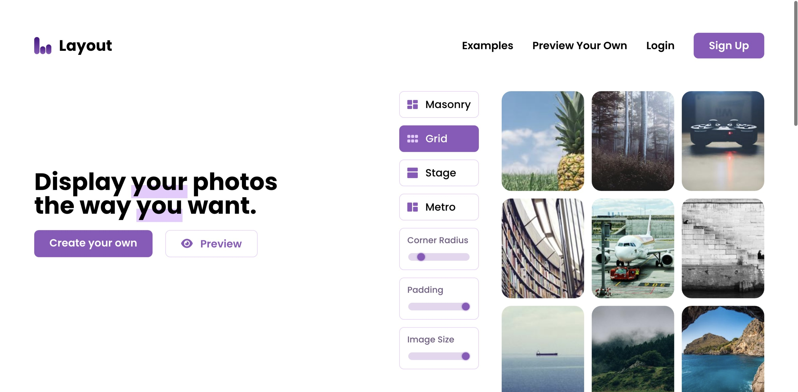

# Layout.com

A simple photography portfolio builder, made with [Next.js](https://nextjs.org/) and [Supabase](https://supabase.com/), hosted by [Netlify](https://www.netlify.com/).

[](https://app.netlify.com/sites/willowy-mousse-93f33e/deploys)



## Starting up

1. Install dependencies

```
yarn install
```

2. Start the dev server

```
yarn dev
```

> The server is now live at `localhost:3000`.
